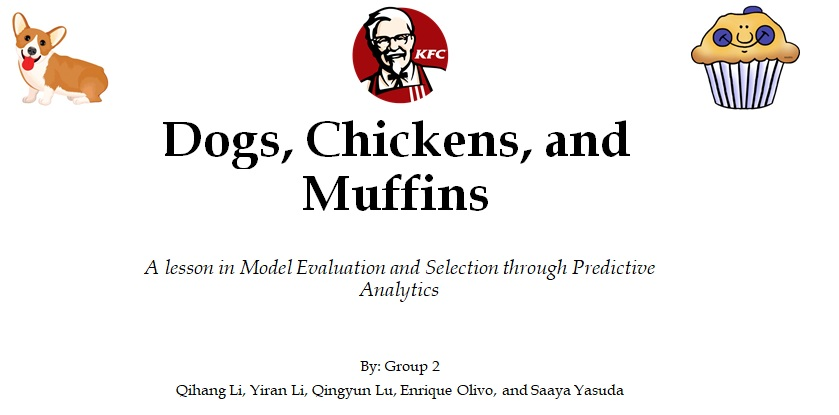

### [Full Project Description](doc/project3_desc.md)

Term: Fall 2017

+ Group 2
+ Team members
	+ Li, Yiran
	+ Lu, Qingyun
	+ Olivo, Enrique (Presenter)
	+ Yasuda, Saaya
	+ Li, Qihang

+ Project summary: In this project, we sought to improve the predictive power of a client's baseline prediction model which used Boosted Decision Stumps (via "gbm" package in R) on SIFT generated features. By generating different Features and considering different Classifier Models, our group went through a process of model selection in order to find the model that was best able to predict whether an image represented a Dog, a piece of Fried Chicken, or a Muffin. Our process of model selection will be outlined in our Oral Presentation, the slides of which are uploaded in this repository. The relevant code scripts and data files are also included in this repository for your reference. In the end, our group concluded that a strong candidate for the best predictive model would be **XGBOOST with SIFT Features**.
	
**Contribution statement**: All team members contributed equally in all stages of this project. All team members approve our work presented in this GitHub repository including this contributions statement. 

Enrique Olivo created the PowerPoint slides used for presentation and worked on the GBM Baseline classifier model.

Following [suggestions](http://nicercode.github.io/blog/2013-04-05-projects/) by [RICH FITZJOHN](http://nicercode.github.io/about/#Team) (@richfitz). This folder is orgarnized as follows.

```
proj/
├── lib/
├── data/
├── doc/
├── figs/
└── output/
```

Please see each subfolder for a README file.
